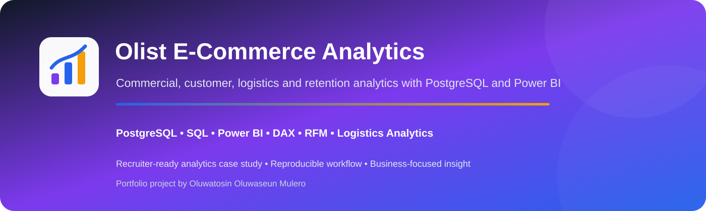
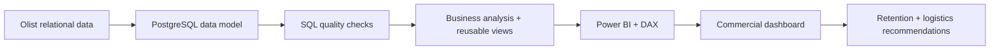
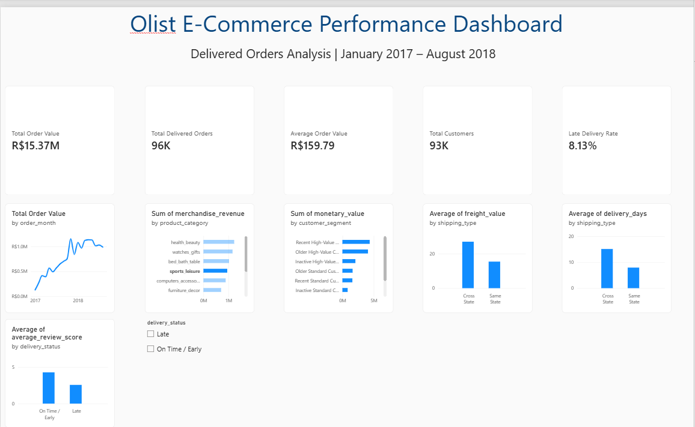

<p align="center">
  
</p>

<p align="center">
  
  
  
  
  
  
</p>

<p align="center"><b>PostgreSQL • SQL • Power BI • DAX • RFM • Logistics Analytics</b></p>

An end-to-end e-commerce analytics case study using the Olist Brazilian marketplace dataset to evaluate sales, customer retention, products, logistics, delivery reliability, review scores and RFM segmentation.

---

## 🎯 Executive Snapshot

| KPI | Result |
| --- | ---: |
| Delivered orders | **96,211** |
| Unique customers | **93,104** |
| Merchandise revenue | **R$13.18M** |
| Freight charged | **R$2.19M** |
| Total order value | **R$15.37M** |
| Average order value | **R$159.79** |
| Repeat customers | **3.00%** |
| Late-delivery rate | **8.13%** |
| Cross-state orders | **64.15%** |

---

## 🧩 Business Problem

The project asks:

1. How did sales and delivered-order volume change over time?
2. Which product categories generated the most revenue?
3. Where is customer demand concentrated?
4. How does cross-state shipping affect freight and delivery time?
5. How strongly are delays associated with review scores?
6. How many customers repeat-purchase?
7. Which RFM segments represent the strongest commercial opportunities?

---

## 🏗️ Analytical Architecture



Full design: [`docs/TECHNICAL_ARCHITECTURE.md`](docs/TECHNICAL_ARCHITECTURE.md)

---

## 📊 Dashboard



---

## 🔎 Key Findings

- **November 2017** recorded the highest monthly total order value at approximately **R$1.15M**.
- Delivered orders increased by approximately **139.94%** between Jan–Aug 2017 and Jan–Aug 2018.
- Total order value increased by approximately **143.36%** over the same comparable period.
- **Health & Beauty** generated the highest merchandise revenue at approximately **R$1.23M**.
- **97% of customers** placed only one delivered order; repeat purchase was just **3%**.
- Cross-state orders averaged **R$26.94** freight versus **R$15.35** for same-state orders.
- Cross-state deliveries averaged **15.12 days** versus **7.92 days** for same-state deliveries.
- Late deliveries averaged **2.57/5** reviews versus **4.30/5** for on-time or early deliveries.
- Orders delivered more than eight days late averaged just **1.73/5**.

---

## 💼 Business Recommendations

- Prioritise proactive intervention for orders at risk of missing estimated delivery dates.
- Review cross-state routing and fulfilment economics.
- Re-engage older and inactive high-value RFM segments.
- Test retention initiatives designed to improve repeat-purchase behaviour.
- Protect high-revenue categories with closer inventory, seller and fulfilment monitoring.
- Track freight-to-order-value ratios for commercially inefficient transactions.

---

## 🧠 SQL & Analytical Engineering

The SQL layer demonstrates:

- primary/foreign-key validation;
- null and duplicate checks;
- timestamp-consistency checks;
- delivered-order filtering for comparable commercial analysis;
- order-level aggregation to prevent double counting;
- use of `customer_unique_id` for repeat-customer analysis;
- review aggregation before satisfaction analysis;
- CTEs, conditional aggregation and window functions;
- reusable PostgreSQL views for Power BI;
- custom RFM frequency logic appropriate to a dataset where 97% of customers purchased once.

---

## 🧰 Technology Stack

<p>
  
  
  
  
  
  
  
</p>

**PostgreSQL · SQL · Power BI · DAX · Power Query · RFM · Git · GitHub · VS Code**

---

## ✅ Quality & Reproducibility

The repository includes an automated **Portfolio Quality** workflow validating required SQL, dashboard and documentation assets.

---

## ⚖️ Methodology & Limitations

- Comparable monthly analysis is restricted to **January 2017–August 2018** because boundary months are incomplete.
- Revenue, customer-value and delivery-performance analysis uses delivered orders for consistency.
- Repeat-customer analysis uses `customer_unique_id`, not order-level `customer_id`.
- RFM segmentation reflects behaviour inside the observed period rather than lifetime customer value.
- Delivery relationships are observational and do not establish causality.

---

## 📁 Repository Structure

```text
olist-ecommerce-analysis/
├── .github/workflows/portfolio-quality.yml
├── docs/
├── images/
│   ├── readme/hero.svg
│   └── olist_dashboard.png
├── powerbi/
├── sql/
│   ├── 01_data_quality_checks.sql
│   └── 02_business_analysis.sql
└── README.md
```

---

## 👨🏾‍💻 Author

**Oluwatosin Oluwaseun Mulero**  
**Data Analyst | Data Scientist | Business Intelligence**
