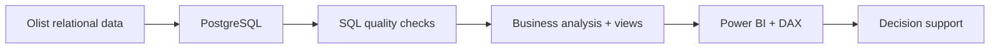

# Technical Architecture

## Purpose

This document explains how the project moves from source data to decision-support outputs while keeping transformation, validation, analysis and presentation responsibilities distinct.

## End-to-End Flow

## Engineering Principles

- **Separation of concerns:** preparation, validation, analysis and presentation are treated as distinct stages.
- **Reproducibility:** analytical assets are version controlled and documented.
- **Metric discipline:** KPI definitions are designed to avoid double counting and inappropriate aggregation.
- **Data quality:** identifiers, dates, duplicates, missing values and reconciliation rules are checked before interpretation.
- **Transparent scope:** time windows, populations and limitations are documented.
- **Responsible interpretation:** observational relationships are not presented as causal.
- **Business alignment:** every major output maps back to a business or operational question.

## Review Path

A reviewer should be able to move through the repository in this order:

**Business question → source/cleaning logic → analytical method → dashboard evidence → recommendation → limitation**
